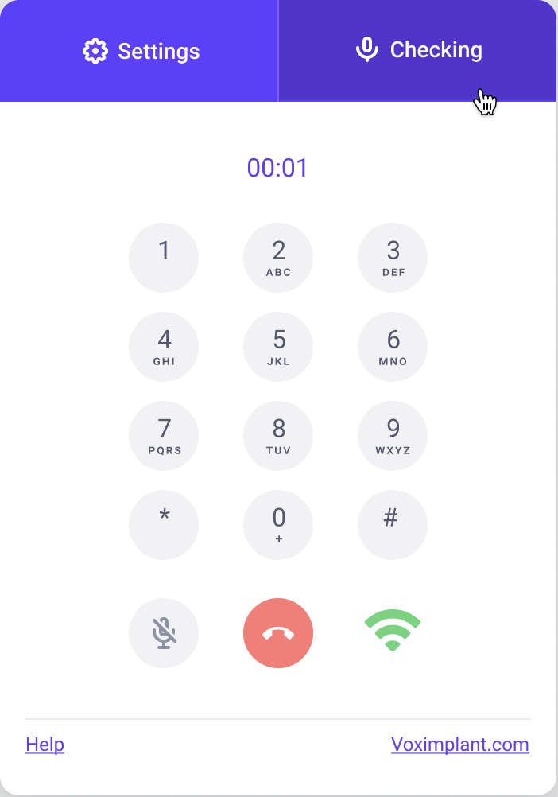
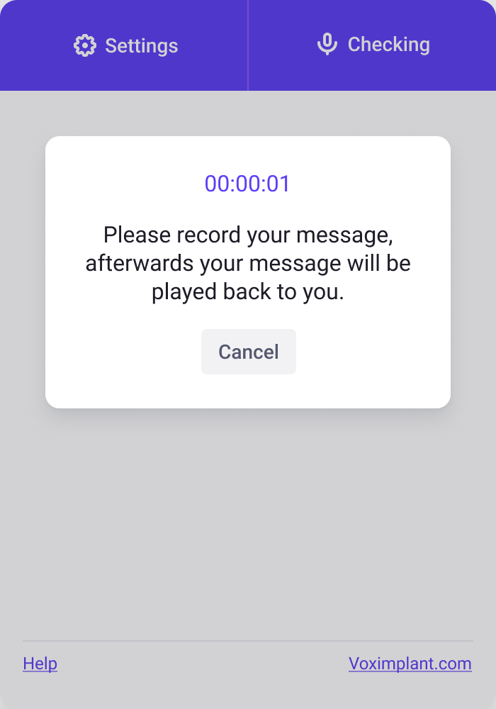
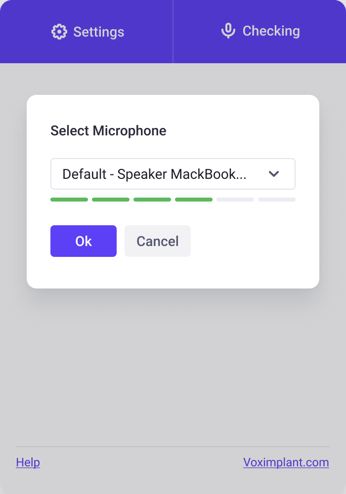

# Click to call

Click to call is **a button for your website** that allows your customers to make a call over VoIP without leaving the website.

Key features:

* Call a Voximplant user / SIP address / phone number
* You can dial an extention number after the call establishes
* You can mute/unmute your microphone during the call
* You can choose the microphone and test it by recording your voice and playing it back
* You can see the connection status and quality

## Screenshots

## How to use

The setup consists of two parts: VoxEngine cloud setup and the widget's source code setup.

### VoxEngine setup

[Follow the instruction](https://voximplant.com/docs/tutorials/calls/click-to-call-for-web-and-mobile-application) to set up the cloud part before you download the source code.

### Application setup

1. Download the widget repository
1. Run `yarn install` or `npm install` in the widget directory
1. Rename the **.env.example** file to **.env**
1. In the **.env** file:
    - Fill your user credentials into the `VUE_APP_USER` and `VUE_APP_PASSWORD` properties
    - Add the number to call to the `VUE_APP_NUMBER` property
    - Fill the `testmic` string to the `VUE_APP_TEST_NUMBER` property
1. Run `yarn serve` or `npm run serve` to run the development build
1. Open the http://localhost:8080/ URL to test the application
1. Once the application works correctly, you can assemble the application
1. If you do not plan to upload the application to the webserver root folder, set up the `publicPath` property in the `vue.config.js` file. [See the instruction](https://cli.vuejs.org/config/#publicpath)
1. To make a production build, run `yarn build` or `npm run build`
1. The `dist` directory will contain the production build ready to upload to the server.

## Folder descriptions

- **public** — Project's static materials, such as favicon and the index.html template, where you can add any additional code, such as action counters
- **src** — Click-to-call project code
    - **assets** — Assets: images and sounds
    - **components** — Application source code
    - **router** — Application routing files
    - **views** — Application pages: Home.vue is the default page, Button.vue is the button page to be placed on the website

## Miscellaneous

* The **get** parameters starting with `x-` are sent as headers to the VoxEngine scenario
* You can see the widget example in new window at: [http://localhost:8080/button](http://localhost:8080/button)
